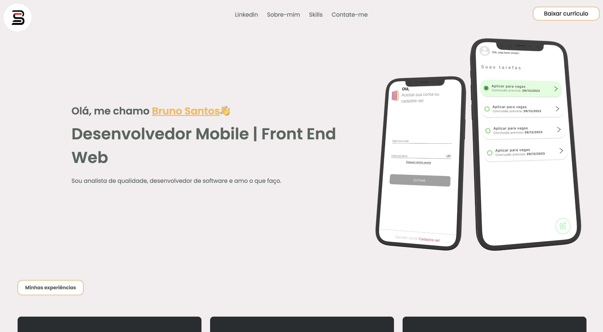

# Design de Portifolio pessoal

Neste projeto utilizei HTML e CSS para criar um design de portfólio totalmente responsivo com um tema de cores escolhido a dedo. Este projeto contém barra de navegação, donwload imediato do meu currículo, seção principal, seção de habilidades, seção sobre mim, botão para contato direto no meu e-mail profissional, seção skills e um rodapé incrível!

# Screenshot
Veja uma demonstração :

